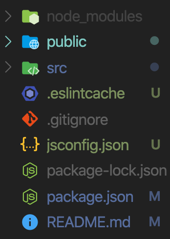

# 02. Project Setup

### 2-1 Setting Up the Project

- creat-react-app
  - creat-react-app 는 React로 작업 하기 위한 환경을 제공해줌
  - npm -g 으로 다운로드 하는 것 보다 npx로 다운로드 할 것을 추천.
       :npx runs a package without installing it.

```
    npx create-react-app
    create-react-app [프로젝트명]reactreact
```

- make jsconfig.json
  - jsconfig.json을 설정해서 기본적으로 src 폴더를 보게 설정

```javascript
{
  "rootDir": "src",
  "compilerOptions": {
      "baseUrl": "src",
      "paths": {
      "*": ["*"]
      }
  }
}
```

</img>
